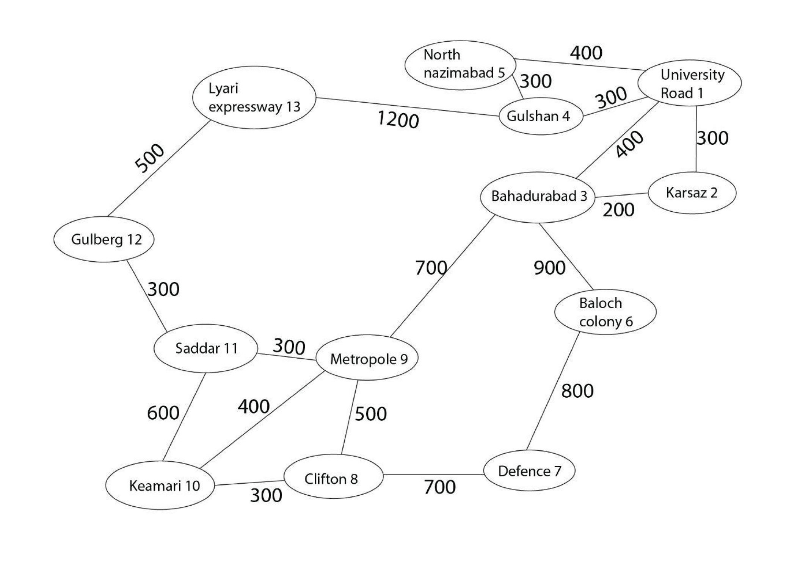

# 🚗 Elite Drive
**Elite Drive** is a ride-hailing system inspired by Uber, built in C++ using core Data Structures and Algorithms concepts. It features rider and driver registration, ride matching based on capacity, fare calculation using Dijkstra’s algorithm, file handling for data persistence, and an admin panel to manage records and feedback.

## 🚀 Features

- User and driver registration with proper validation  
- Persistent storage of user and driver data using file handling  
- Ride booking with pickup and drop-off location  
- Fare calculation using Dijkstra's algorithm for shortest path  
- Random driver assignment from registered driver data  
- Car assignment using linked list based on passenger count  
- Rider feedback system  
- Admin panel to view all rider and driver records  
- Admin access to all stored feedback

## 🛠 Tech Stack

- **Language:** C++
- **DSA Concepts Used:**  
  - Dijkstra’s Algorithm (shortest path for fare calculation)  
  - Linked Lists (car management)  
  - Arrays and Maps (user/driver management)  
  - File Handling (persistent data)  
- **OOP Concepts:**  
  - Classes & Objects  
  - Inheritance  
  - Polymorphism  
  - Encapsulation

## 🧭 How to Use

1. **Clone the Repository**
   ```bash
   git clone https://github.com/FatimaNW/Elite-Drive.git
   ```
   
2. **Compile the Code**      
   Use any C++ compiler and run the file `Elite_Drive.cpp`

3. **Choose a Role from the Menu**  
   - Rider  
   - Driver  
   - Admin (Username: `dsaa`, Password: `dsaa.project`)

4. **Registration**  
   - Enter valid details, example: phone number, CNIC (for drivers)  
   - Data will be stored in files automatically  

5. **Book a Ride (Rider)**  
   - Choose pickup/drop-off  
   - Fare is calculated  
   - Car is assigned based on passenger count  
   - Feedback can be given after ride  

6. **Admin Options**  
   - View all saved records  
   - Read feedback

## 📄 Files Generated

These files are automatically created if they don’t exist and updated throughout use.

- `Available_Drivers.txt`
- `Driver_Details.txt` 
- `Registered_Riders.txt`   
- `Rider_Feedback.txt` 
   
## 🗺️ Route Graph

The following graph represents the available ride routes in Elite Drive.

 - **Nodes** are city areas (pickup/drop-off points)
 - **Edges** represent fare (in PKR) between two connected areas.
 - **Dijkstra’s Algorithm** is used to calculate the shortest path (i.e., minimum fare) between a rider’s pickup and drop-off location.



#
**Note:** This project was created during my second year of university as part of Data Structure Algorithms & Applications course.
